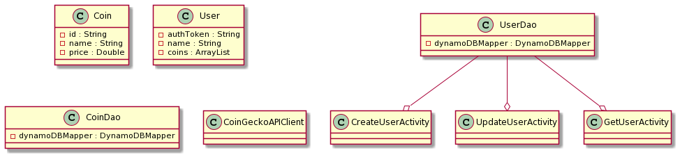
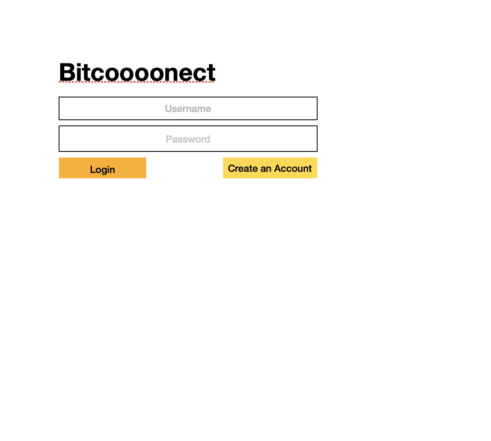
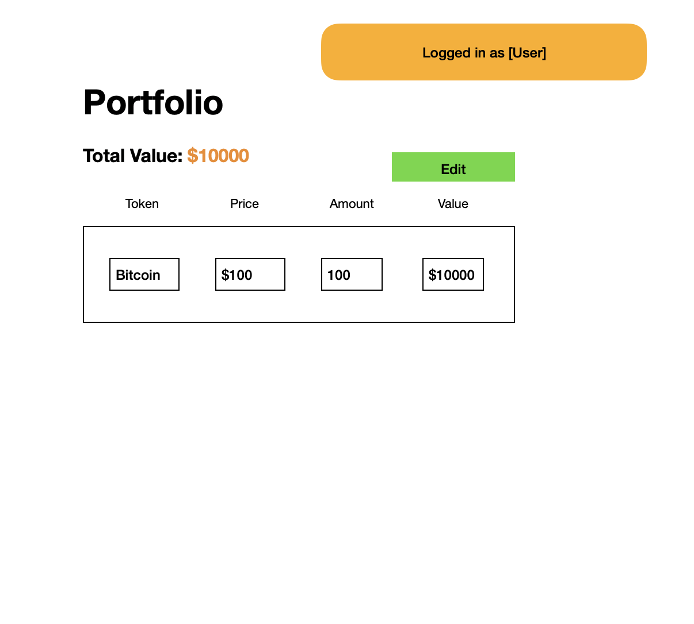
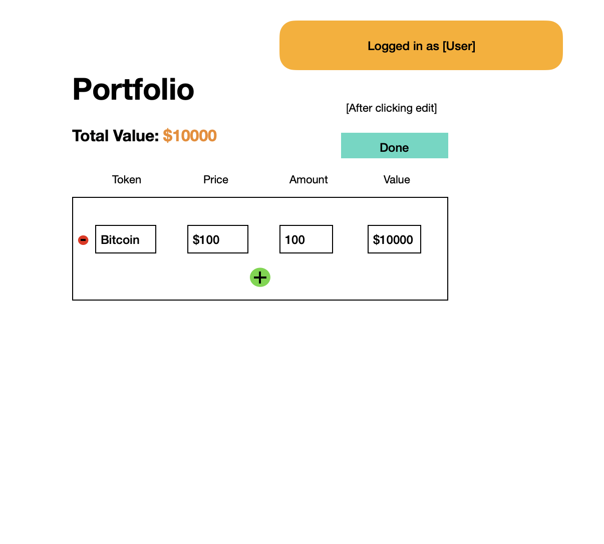
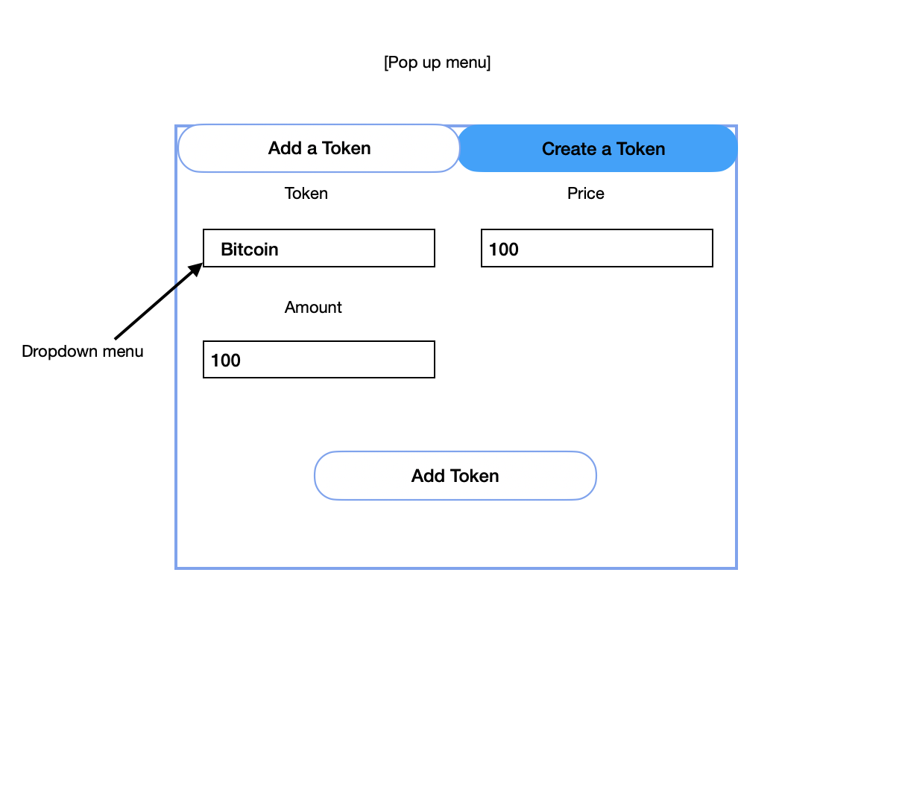

# Team Bitcoooonnect Design Document

## Instructions

Input coin type and quantity, get prices using coin price aggregator api 

## Team Bitcoooonnect Design


## 1. Problem Statement

It's hard to track cryptocurrencies that you own, because they're on different centralized exchanges or stored in different wallets.

## 2. Top Questions to Resolve in Review

1. How to set up a login framework and which framework to use.
2. How to integrate Coinbase and CoinGecko API.
3. Which frontend framework to use.

## 3. Use Cases

U1. As a Bitcoooonect customer, I want to see my cryptocurrency holdings when I login to Bitcoooonect.

U2. As a Bitcoooonect customer, I want to add new coins to my cryptocurrency holdings on Bitcoooonect.
    
U3. As a Bitcoooonect customer, I want to remove coins from my cryptocurrency holdings on Bitcoooonect.

U4. As a Bitcoooonect customer, I want to update the amount of my exisiting cryptocurrency holdings.

## 4. Project Scope

### 4.1. In Scope

Viewing and managing their current cryptocurrency holdings. This includes seeing the cryptocurrencies that they hold, the amount,
and the price($USD). Customers can update their portfolio to reflect their actual holdings across all exchanges.

### 4.2. Out of Scope

* There are a vast amount of centralized exchanges that users can be storing their crypto on. As a result integrating all these APIs to provide real time holding updates would be useful but is currently out of scope.

* Trading cryptocurrencies directly on our platform is a feature that is out of scope.

* Real time prices updates will not be supported. In order for users to view prices they will need to make a new GET request. The prices that we show are limited to Coingecko's API terms, therefore users might not be able to make many GET requests for the most up to date prices. 

# 5. Proposed Architecture Overview



This initial iteration will provide the minimum viable product (maybe loveable) including creating a user, retrieving user, adding tokens, retrieving and updating tokens in portfolio, updating token amount, and retrieving prices from an external API.

We will use API Gateway and Lambda to create three endpoints (`CreateUserActivity`,`UpdateUserUserActivity`, `GetUserActivity`)

We will store user and coin information in tables in DynamoDB. We will be utilizing the "CoinGecko" to retrieve the latest prices on an interval(every sixty seconds).

Bitcoooonnect will provide a front-end interface for users to manage their crypto portfolios. Initially this will be a login screen, an overall portfolio view page showing their holdings, the amounts, and prices, and a menu to add new a token to their holdings or update the amount of an existing holding.

Our user authentication will be basic, will be authenticating user by an authentication token from DynamoDB.

# 6. API

## 6.1. Public Models

```
CoinModel

id // string
name // string
price // double
```

```
UserModel

authToken // partition key string
name // string
coins // list [[coinId, amount], ...]
```

## 6.2 Public EndPoints

### 6.2.1 Get portfolio Endpoint
  * Accepts `GET` requests to `/portfolio`
  * returns User's portfolio.
  * If the given User ID is not found, will throw a `UserNotFoundException`
### 6.2.2 Update portfolio Endpoint
  * Accepts `PUT` requests to `/portfolio` 
  * Accepts other required data: coin, amount, authToken
    * if authToken is not found will throw an `UserNotFoundException`
    * if the amount not greater than 0 will throw an `InvalidAttributeValueException`
    * if the coin is not found will throw a `CoinNotFoundException`
  * returns newly created UserUser
### 6.2.3 Create User Endpoint
  * Accepts `POST` requests to `/users`
  * Accepts other optional data: name
    * if not not provided, name will be generated for the user
  * return new created user along with authToken


# 7. Tables
### 7.1. `coin`
```
id // partition key, string
name // string
price // number
```

### 7.3. `user`
```
authToken // partition key string
name // string
coins // list [[coinId, amount], ...]
```

# 8. Pages





