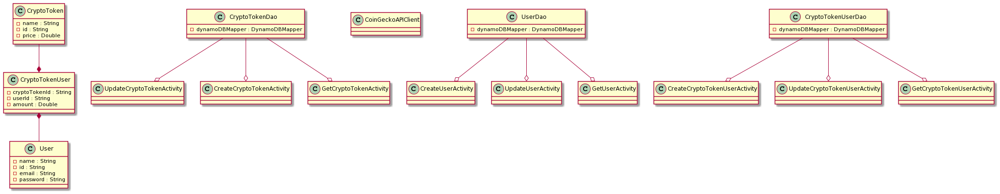

# Team Bitcoooonnect Design Document

## Bitcoooonnect Design

## 1. Problem Statement

It's hard to track cryptocurrencies that you own, because they're on different centralized exchanges or stored in different wallets.

## 2. Top Questions to Resolve in Review

1. How to set up a login framework and which framework to use.
2. How to integrate Coinbase and CoinGecko API.
3. Which frontend framework to use.

## 3. Use Cases

U1. As a Bitcoooonect customer, I want to see my cryptocurrency holdings when I login to Bitcoooonect.

U2. As a Bitcoooonect customer, I want to add new coins to my cryptocurrency holdings on Bitcoooonect.
    
U3. As a Bitcoooonect customer, I want to remove coins from my cryptocurrency holdings on Bitcoooonect.

U4. As a Bitcoooonect customer, I want to update the amount of my exisiting cryptocurrency holdings.

## 4. Project Scope

### 4.1. In Scope

Viewing and managing their current cryptocurrency holdings. This includes seeing the cryptocurrencies that they hold, the amount,
and the price($USD). Customers can update their portfolio to reflect their actual holdings across all exchanges.

### 4.2. Out of Scope

* There are a vast amount of centralized exchanges that users can be storing their crypto on. As a result integrating all these APIs to provide real time holding updates would be useful but is currently out of scope.

* Trading cryptocurrencies directly on our platform is a feature that is out of scope.

* Real time prices updates will not be supported. In order for users to view prices they will need to make a new GET request. The prices that we show are limited to Coingecko's API terms, therefore users might not be able to make many GET requests for the most up to date prices. 

# 5. Proposed Architecture Overview



This initial iteration will provide the minimum viable product (maybe loveable) including creating a user, retrieving user adding tokens, retrieving tokens, updating tokens in portfolio, updating token values, and retrieving prices from an external API.

We will use API Gateway and Lambda to create nine endpoints (`UpdateCryptoTokenActivity`, `CreateCryptoTokenActivity`, `GetCryptoTokenActivity`, `CreateUserActivity`, `UpdateUserActivity`, `GetUserActivity`, `CreateCryptoTokenUserActivity`, `UpdateCryptoTokenUserActivity`, `GetCryptoTokenUserActivity`)

We will store user information, crypto token information, and user crypto token information in tables in DynamoDB. Although we could retrieve most crypto token information from an external source via an API, we believe it will be better to seed our program with token information to reduce reliance on outside services (mostly the number of calls we will be making to external APIs). We will be utilizing the "CoinGecko" to retrieve the latest prices on a users holdings at the time of a get request.

Bitcoooonnect will also provide a front-end interface for users to manage their crypto portfolios. Initially this will be a login screen, an overall portfolio view page showing their holdings, the amounts, and prices, and a menu to add new a token to their holdings or update the amount of an existing holding.

Our user authentication will be basic, simply matching the user inputted email and password on our front-end interface against the records stored in our user table in DynamoDB.

# 6. API

## 6.1. Public Models

*Define the data models your service will expose in its responses via your
*`-Model`* package. These will be equivalent to the *`PlaylistModel`* and
*`SongModel`* from the Unit 3 project.*

## 6.2. *First Endpoint*

*Describe the behavior of the first endpoint you will build into your service
API. This should include what data it requires, what data it returns, and how it
will handle any known failure cases. You should also include a sequence diagram
showing how a user interaction goes from user to website to service to database,
and back. This first endpoint can serve as a template for subsequent endpoints.
(If there is a significant difference on a subsequent endpoint, review that with
your team before building it!)*

*(You should have a separate section for each of the endpoints you are expecting
to build...)*

## 6.3 *Second Endpoint*

*(repeat, but you can use shorthand here, indicating what is different, likely
primarily the data in/out and error conditions. If the sequence diagram is
nearly identical, you can say in a few words how it is the same/different from
the first endpoint)*

# 7. Tables
### 7.1. `crypto_token`
```
id // partition key, string
price // sort key, number
name // string
```

### 7.2. `crypto_token_user`
```
userId // partition key, string
cryptoTokenId // sort key, string
amount // number
```

### 7.3. `user`
```
id // partition key, string
name // string
email // string
password // string
```

# 8. Pages

*Include mock-ups of the web pages you expect to build. These can be as
sophisticated as mockups/wireframes using drawing software, or as simple as
hand-drawn pictures that represent the key customer-facing components of the
pages. It should be clear what the interactions will be on the page, especially
where customers enter and submit data. You may want to accompany the mockups
with some description of behaviors of the page (e.g. “When customer submits the
submit-dog-photo button, the customer is sent to the doggie detail page”)*
